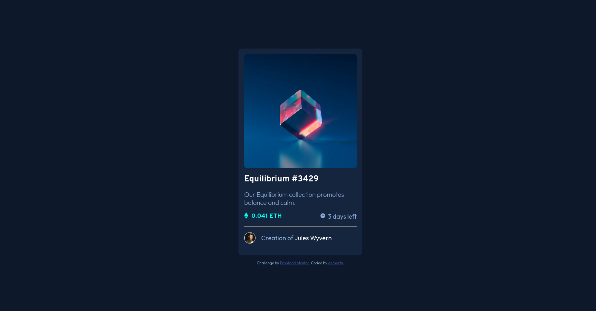

# Frontend Mentor - NFT preview card component solution

This is a solution to the [NFT preview card component challenge on Frontend Mentor](https://www.frontendmentor.io/challenges/nft-preview-card-component-SbdUL_w0U). Frontend Mentor challenges help you improve your coding skills by building realistic projects. 

## Table of contents

- [Overview](#overview)
  - [The challenge](#the-challenge)
  - [Screenshot](#screenshot)
  - [Links](#links)
- [My process](#my-process)
  - [Built with](#built-with)
  - [What I learned](#what-i-learned)
  - [Continued development](#continued-development)
  - [Useful resources](#useful-resources)
- [Author](#author)
- [Acknowledgments](#acknowledgments)

## Overview

### The challenge

Users should be able to:

- View the optimal layout depending on their device's screen size
- See hover states for interactive elements

### Screenshot

### Links

- Solution URL: [Add solution URL here](https://github.com/aemerta/nft_preview_card_component/)
- Live Site URL: [Add live site URL here](https://aemerta.github.io/nft_preview_card_component/)

## My process
-setup variables
- write html
- write css

### Built with

- Semantic HTML5 markup
- SCSS
- Flexbox
- Mobile-first workflow

### What I learned
This is my first time learning and writing SCSS. 
from this project i learned how to:
- SCSS
- use pseudo element to display decorative image.
- make an overlay image on hover

### Continued development
writing better css. DRY one.

### Useful resources

- [https://www.youtube.com/watch?v=_a5j7KoflTs] - SASS tutorial.

## Author

- Twitter - [https://www.twitter.com/aemerta]

